# SMLReader

An ESP8266 based smart meter (SML) and Modbus RTU to MQTT gateway,

## About

The aim of this project is to read the meter readings of modern energy meters and make them available via MQTT.

The software was primarily developed and tested for the EMH ED300L electricity meter, but should also work with other energy meters that have an optical interface and communicate via the SML protocol or use Modbus RTU.

SMLReader publishes the metrics read from the meter's optical unit or the 3-wire connected Modbus to an MQTT broker configured via the provided web interface.

The modbus interface is normally a MAX485 (with direction-control) or a MAX13485 (with auto-direction), but you can use any other RS-485 interface chip which is compatible to the 3.3 volt the ESP needs.

> [!WARNING]
> Most interface transceivers use 5V, so be careful and don't connect the output (e.g. the data out pin "RO") directly to the ESP Module, in the schematic a voltage divider is used.

The modbus part was tested with two [Eastron SDM630](https://www.eastroneurope.com/products/view/sdm630modbus) and because it's a RS485 bus you can theoretically connect up to 255 energy meters.
It uses the lib [SDM_Energy_Meter](https://github.com/reaper7/SDM_Energy_Meter) where many other energy meter models are listed with register descriptions.
To change the requested registers you have to edit the code, see Configuration later.

If you like this project, you might consider to [support me](#donate).

### Screenshots


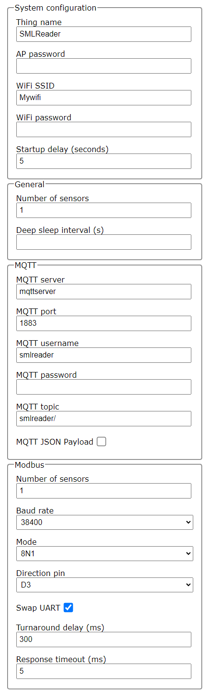
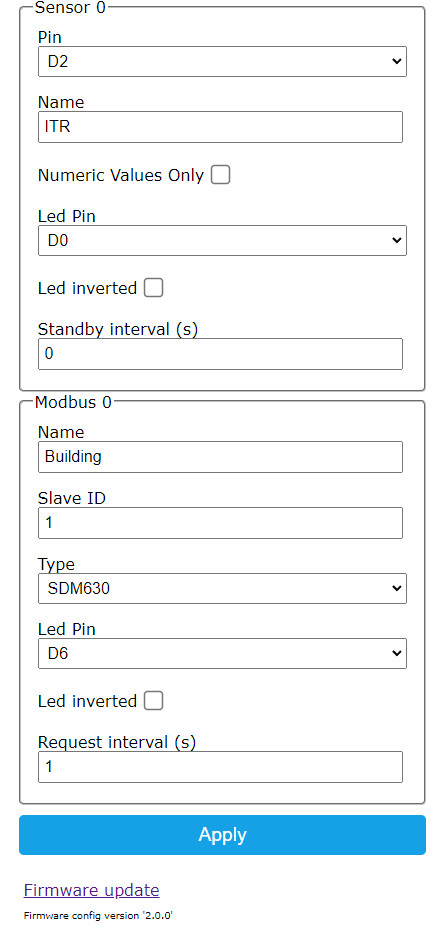

SML output:

```bash
MB-Monty ➜  ~  mosquitto_sub -h 10.4.32.103 -v -t smartmeter/mains/#
smartmeter/mains/info Hello from 00C7551E, running SMLReader version 2.1.5.
smartmeter/mains/sensor/1/obis/1-0:1.8.0/255/value 3546245.9
smartmeter/mains/sensor/1/obis/1-0:2.8.0/255/value 13.2
smartmeter/mains/sensor/1/obis/1-0:1.8.1/255/value 0.0
smartmeter/mains/sensor/1/obis/1-0:2.8.1/255/value 13.2
smartmeter/mains/sensor/1/obis/1-0:1.8.2/255/value 3546245.9
smartmeter/mains/sensor/1/obis/1-0:2.8.2/255/value 0.0
smartmeter/mains/sensor/1/obis/1-0:16.7.0/255/value 451.2
```

Modbus output:

```bash
[stefan@kali ~]$ mosquitto_sub -h localhost -u smlreader -P smlreader -v -t smlreader/#
smlreader/LWT Online
smlreader/modbus/Haus/id 1
smlreader/modbus/Haus/error {"success":2902,"fail":36,"crc":0,"wb":0,"neb":0,"tmt":18}
smlreader/modbus/Haus/last_error timeout
smlreader/modbus/Haus/voltage_L1 229.0
smlreader/modbus/Haus/voltage_L2 0.0
smlreader/modbus/Haus/voltage_L3 0.0
smlreader/modbus/Haus/current_L1 0.000
smlreader/modbus/Haus/current_L2 0.000
smlreader/modbus/Haus/current_L3 0.000
smlreader/modbus/Haus/power_L1 0
smlreader/modbus/Haus/power_L2 0
smlreader/modbus/Haus/power_L3 0
smlreader/modbus/Haus/current_sum 0.000
smlreader/modbus/Haus/power_total 0
smlreader/modbus/Haus/power_apparent 0
smlreader/modbus/Haus/power_reactive 0
smlreader/modbus/Haus/power_factor 1.000
smlreader/modbus/Haus/phase_angle 0
smlreader/modbus/Haus/frequency 49.98
smlreader/modbus/Haus/energy_import 1.002
smlreader/modbus/Haus/energy_export 0.069
smlreader/modbus/Haus/current_N 0.000
```


### Hardware

#### Reading head

The reading head consists of a phototransistor (BPW 40 or SFH309) and a 1 kΩ pull-up resistor connected to one of the GPIO pins of the microcontroller.
Other phototransistors or the use of an internal pull-up resistor will probably work, too.

The housing of my reading head has been 3D-printed using the [STL files](http://www.stefan-weigert.de/php_loader/sml.php) from [Stefan Weigert](http://www.stefan-weigert.de). 

A ring magnet (in my case dimensioned 27x21x3mm) ensures that the reading head keeps stuck on the meter.

The phototransistor has been fixed with hot glue within the housing.

  


Another hardware with a [Hammond case 1551MBK](https://www.hammfg.com/electronics/small-case/plastic/1551)

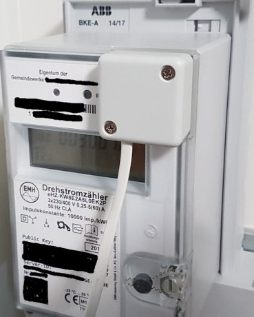 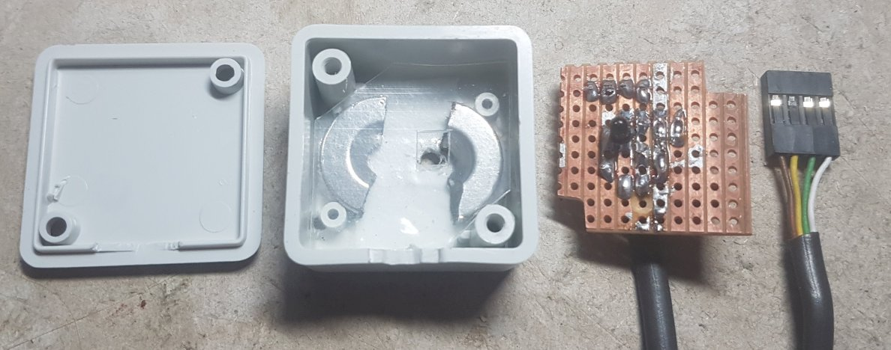 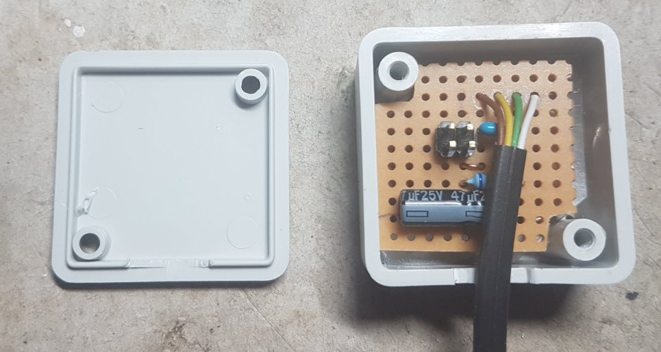

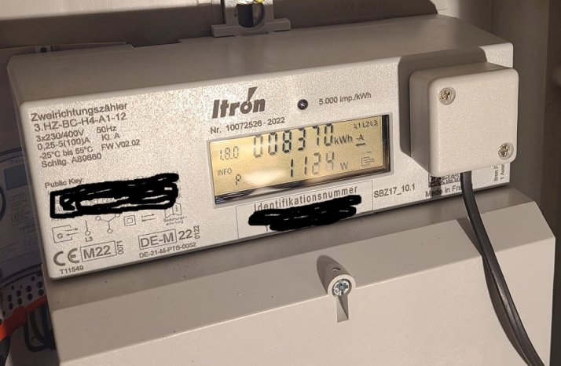
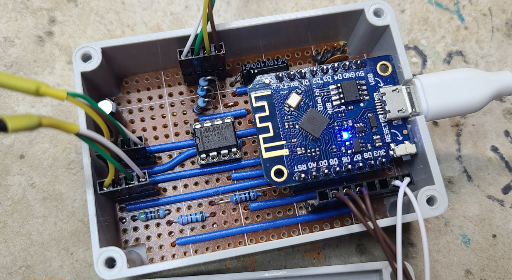
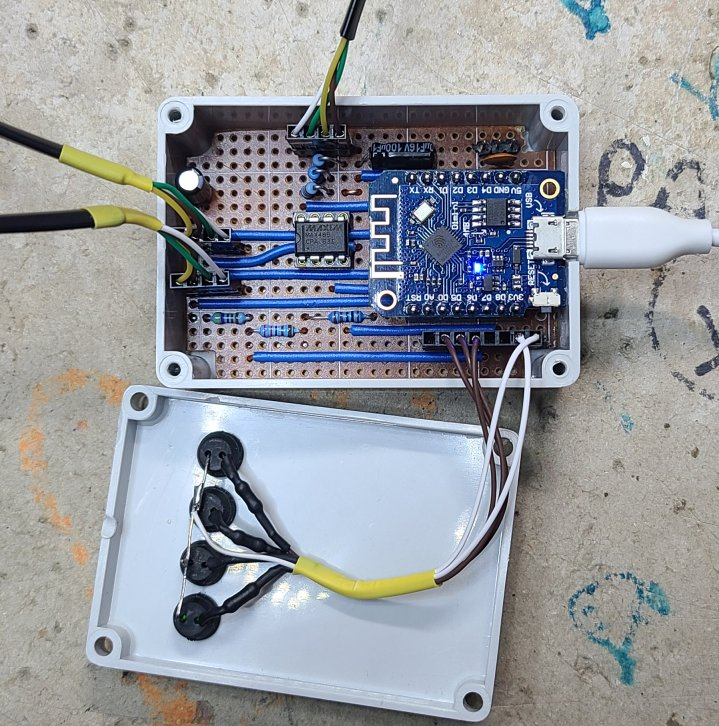
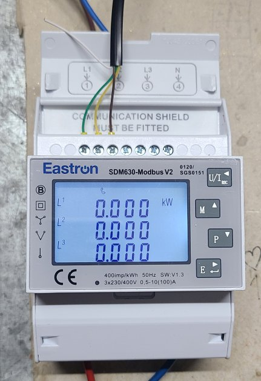


#### Schematic diagram


Circuit example with 2 SML sensors and Modbus:
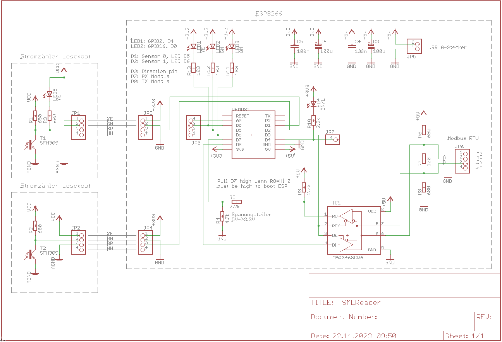

## Getting started

To get started, the software must first somehow get onto the device. 
This can be done in several ways.

### Uploading a precompiled binary

A precompiled binary for the Wemos D1 and configured to have a sensor attached to pin D2 can be downloaded from the releases page on GitHub:  

[https://github.com/mruettgers/SMLReader/releases](https://github.com/mruettgers/SMLReader/releases)

#### Flashing

This precompiled binary can be flashed to the device with the help of [esptool.py](https://github.com/espressif/esptool).
Other tools should also work, as long as you have configured them to match the specs of your ESP8266.

```bash
esptool.py --port /dev/ttyUSB0 write_flash -fm dout 0x00000 path/to/smlreader.bin
```

As a docker enthusiast I prefer to utilize a dockerized version of esptool.py by bind-mounting the current working directory to `/src` and assuming that `smlreader.bin` is existing in the current working directory:
```bash
docker run -it --device /dev/ttyUSB0 -v $(pwd):/src --rm mruettgers/esptool --port /dev/ttyUSB0 write_flash -fm dout 0x00000 /src/smlreader.bin
```

The device path and the path to the binary have to be adjusted to fit your needs.


##### Example

```bash
nb-ubuntu ➜  ~/Downloads  ls SMLReader_D1mini_v2.1.3.bin                                                                                                         
SMLReader_D1mini_v2.1.3.bin

nb-ubuntu ➜  ~/Downloads  docker run -it --device=/dev/ttyUSB0 -v $(pwd):/src --rm mruettgers/esptool --port /dev/ttyUSB0 write_flash -fm dout 0x00000 /src/SMLReader_D1mini_v2.1.3.bin
esptool.py v2.8
Serial port /dev/ttyUSB0
Connecting....
Detecting chip type... ESP8266
Chip is ESP8266EX
Features: WiFi
Crystal is 26MHz
MAC: d8:f1:5b:07:0d:eb
Uploading stub...
Running stub...
Stub running...
Configuring flash size...
Auto-detected Flash size: 4MB
Flash params set to 0x0340
Compressed 378528 bytes to 266738...
Wrote 378528 bytes (266738 compressed) at 0x00000000 in 23.6 seconds (effective 128.1 kbit/s)...
Hash of data verified.

Leaving...
Hard resetting via RTS pin...
```

---

### Using your IDE for building and flashing

You should be able to use your preferred IDE to build and flash SMLReader if you take care of the dependencies and the build flags configured in the `platform.io` file.
I strongly recommend using PlatformIO as it takes care of that itself.


#### Building

Building SMLReader in PlatformIO is straight forward and can be done by executing the build task matching your environment (i.e. `d1_mini`).

In case you get the following error, it is time to install a Git client (https://git-scm.com/downloads) and to make sure that the path to `git` is covered by the PATH variable and `git` is thus executable from everywhere.

```
UserSideException: Please install Git client from https://git-scm.com/downloads:
  File "/home/monty/.platformio/penv/lib/python3.8/site-packages/platformio/builder/main.py", line 168:
    env.SConscript("$BUILD_SCRIPT")
```


#### Flashing


---


### Running

WiFi and MQTT are configured via the web interface provided by [IotWebConf](https://github.com/prampec/IotWebConf) which can be reached after joining the WiFi network named SMLReader and heading to http://192.168.4.1.   
If the device has already been configured, the web interface can be reached via the IP address obtained from your local network's DHCP server.
To login provide the user `admin` and the configured AP password.

> [!IMPORTANT]
> ***Attention: You have to change the AP Password (empty by default), otherwise SMLReader won't work.***

> [!TIP]
> If the onboard LED connected to D4 is not configured in the sensor setup it shows the IotWebconf status.
> See [IotWebConf documentation](https://github.com/prampec/IotWebConf/blob/master/doc/UsersManual.md#connecting-to-a-wifi-network) for more info.

---

### Configuration

Configuration for the SML sensors and the Modbus is done at runtime trough the web interface.

**Parameter explanations:**

#### Modbus
* *Number of sensors:*
  > How many meters are connected to the bus
* *Baud rate:*
  > From 2400 to 38400 baud, you have to configure the same speed in the energy meter setup
* *Mode:*
  > The number of bytes (8), none (N), even (E) or odd (O) parity and the number of stop bits (1 or 2)
* *Direction pin:*
  > The output pin for the MAX485 transceiver (RO and DE, see circuit example) so that it can send on the bus. Use "--" for no pin with auto-direction interfaces.
* *Swap UART:*
  > Because normally the hardware UART (named "Serial") TXD0 and RXD0 pins are connected to the USB interface, you have to "swap" them to D8 (TX) and D7 (RX) pins. Unfortunately then you can't get a debug output to the connected Computer over USB, but there's an option in the code to detour the debug output (if compiled) to "Serial1" (D4, GPIO2). That's only one TX line.
* *Turnaround delay (ms):*
  > Timeout to wait for the answer of the meter
* *Response timeout (ms):*
  > Time to wait after reading the answer to send the next request, for the SDM630 one ms is enough (2 ms are hard coded)

#### Modbus sensors
* *Name:*
  > The name which goes to the mqtt topic "name"
* *Slave ID:*
  > Modbus slave identification number, must be set in the meter and every device id must be unique
* *Type:*
  > The modbus meter type, see below
* *Led Pin:*
  > You can use the onboard led or connect one external, or "--" for none.
* *Led inverted:*
  > Some LEDs (like the ESP8266 builtin LED) require an inverted output signal
* *Request interval (s):*
  > Time to wait between requests


Like stated above, for modbus energy meters other than the SDM630 you have to change the registers or add another type in webconf.h (line 107) and modbus.h (line 18 and 208).

```
#define NBREG 22 // number of sdm registers to read
volatile sdm_struct sdmarr[NBREG] = {
// float value, register number, mqtt name, precision
    {NAN, SDM_PHASE_1_VOLTAGE, "voltage_L1", 1}, // V
    {NAN, SDM_PHASE_2_VOLTAGE, "voltage_L2", 1}, // V
    {NAN, SDM_PHASE_3_VOLTAGE, "voltage_L3", 1}, // V
    {NAN, SDM_PHASE_1_CURRENT, "current_L1", 3}, // A
    {NAN, SDM_PHASE_2_CURRENT, "current_L2", 3}, // A
    {NAN, SDM_PHASE_3_CURRENT, "current_L3", 3}, // A
    {NAN, SDM_PHASE_1_POWER, "power_L1", 0},     // W
    {NAN, SDM_PHASE_2_POWER, "power_L2", 0},     // W
    {NAN, SDM_PHASE_3_POWER, "power_L3", 0},     // W

    {NAN, SDM_SUM_LINE_CURRENT, "current_sum", 3},               // A
    {NAN, SDM_TOTAL_SYSTEM_POWER, "power_total", 0},             // W
    {NAN, SDM_TOTAL_SYSTEM_APPARENT_POWER, "power_apparent", 0}, // VA
    {NAN, SDM_TOTAL_SYSTEM_REACTIVE_POWER, "power_reactive", 0}, // VAr
    {NAN, SDM_TOTAL_SYSTEM_POWER_FACTOR, "power_factor", 3},     // None
    {NAN, SDM_TOTAL_SYSTEM_PHASE_ANGLE, "phase_angle", 0},       // Degr.
    {NAN, SDM_FREQUENCY, "frequency", 2},                        // Hz

    {NAN, SDM_NEUTRAL_CURRENT, "current_N", 3},

    {NAN, SDM_LINE_1_TO_LINE_2_VOLTS, "voltage_L1_L2", 1}, // V
    {NAN, SDM_LINE_2_TO_LINE_3_VOLTS, "voltage_L2_L3", 1}, // V
    {NAN, SDM_LINE_3_TO_LINE_1_VOLTS, "voltage_L3_L1", 1}, // V

    {NAN, SDM_IMPORT_ACTIVE_ENERGY, "energy_import", 3},         // kWh
    {NAN, SDM_EXPORT_ACTIVE_ENERGY, "energy_export", 3},         // kWh
};

```

Here i use four register blocks to read out the most useful values:
```
  SDM_PHASE_1_VOLTAGE to SDM_PHASE_3_POWER                  (0x0000 to 0x0010)
  SDM_SUM_LINE_CURRENT to SDM_FREQUENCY                     (0x0030 to 0x0046)
  SDM_LINE_1_TO_LINE_2_VOLTS to SDM_LINE_3_TO_LINE_1_VOLTS  (0x00C8 to 0x00CC)
  SDM_IMPORT_ACTIVE_ENERGY to SDM_EXPORT_ACTIVE_ENERGY      (0x0048 to 0x004A)
```
and a single register:
```
  SDM_NEUTRAL_CURRENT (0x00E0)
```


The first block with 18 registers (9 float values / 32 bytes) is requested in one call instead of a single one for every value to save time, this way the overall request time for all blocks is under 200 ms at 38400 baud and the query interval can be reduced down to 1 second to get live values.
Only the value "SDM_NEUTRAL_CURRENT" (two registers) is requested on its own. See the oscilloscope screenshots:

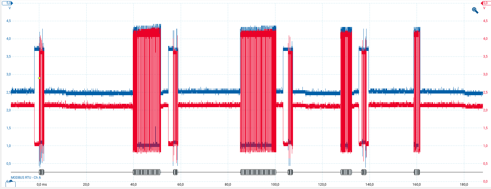
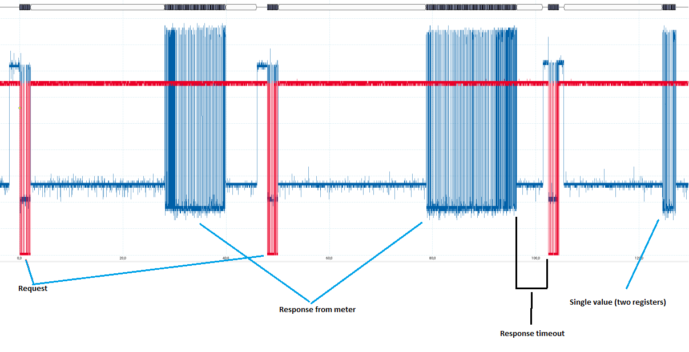
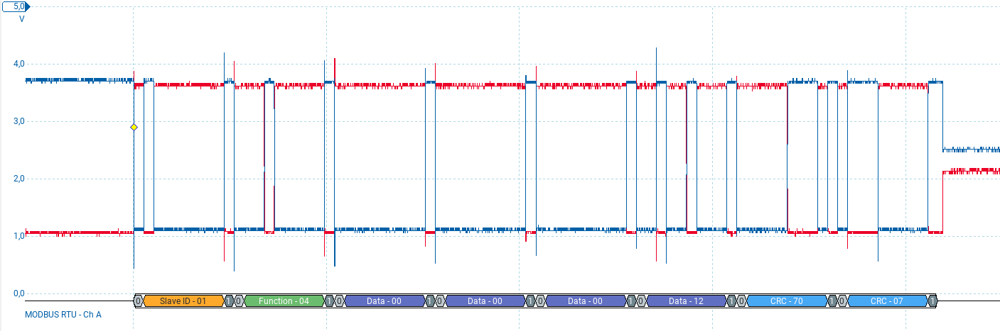


It is also possible to define two modbus slaves with the same name and slave id but different types and request intervals, e.g. to get power/voltage readings every second but the kWh registers every minute.


If everything is configured properly and running with a sensor in place, SMLReader will publish the metrics and values received from the meter to the configured MQTT broker:

#### SML output:
```
MB-Monty ➜  ~  mosquitto_sub -h 10.4.32.103 -v -t smartmeter/mains/#
smartmeter/mains/info Hello from 00C7551E, running SMLReader version 2.1.5.
smartmeter/mains/sensor/Haus/obis/1-0:1.8.0/255/value 3546245.9
smartmeter/mains/sensor/Haus/obis/1-0:2.8.0/255/value 13.2
smartmeter/mains/sensor/Haus/obis/1-0:1.8.1/255/value 0.0
smartmeter/mains/sensor/Haus/obis/1-0:2.8.1/255/value 13.2
smartmeter/mains/sensor/Haus/obis/1-0:1.8.2/255/value 3546245.9
smartmeter/mains/sensor/Haus/obis/1-0:2.8.2/255/value 0.0
smartmeter/mains/sensor/Haus/obis/1-0:16.7.0/255/value 451.2

smartmeter/mains/sensor/2/obis/1-0:1.8.0/255/value 3546245.9
smartmeter/mains/sensor/2/obis/1-0:2.8.0/255/value 13.2
smartmeter/mains/sensor/2/obis/1-0:1.8.1/255/value 0.0
smartmeter/mains/sensor/2/obis/1-0:2.8.1/255/value 13.2
smartmeter/mains/sensor/2/obis/1-0:1.8.2/255/value 3546245.9
smartmeter/mains/sensor/2/obis/1-0:2.8.2/255/value 0.0
smartmeter/mains/sensor/2/obis/1-0:16.7.0/255/value 451.2

smartmeter/mains/sensor/3/obis/1-0:1.8.0/255/value 3546245.9
smartmeter/mains/sensor/3/obis/1-0:2.8.0/255/value 13.2
smartmeter/mains/sensor/3/obis/1-0:1.8.1/255/value 0.0
smartmeter/mains/sensor/3/obis/1-0:2.8.1/255/value 13.2
smartmeter/mains/sensor/3/obis/1-0:1.8.2/255/value 3546245.9
smartmeter/mains/sensor/3/obis/1-0:2.8.2/255/value 0.0
smartmeter/mains/sensor/3/obis/1-0:16.7.0/255/value 451.2
```

#### Modbus output:
```
smlreader/LWT Online
smlreader/modbus/Haus/id 1
smlreader/modbus/Haus/error {"success":2902,"fail":36,"crc":0,"wb":0,"neb":0,"tmt":18}
smlreader/modbus/Haus/last_error timeout
smlreader/modbus/Haus/voltage_L1 229.0
smlreader/modbus/Haus/voltage_L2 0.0
smlreader/modbus/Haus/voltage_L3 0.0
smlreader/modbus/Haus/current_L1 0.000
smlreader/modbus/Haus/current_L2 0.000
smlreader/modbus/Haus/current_L3 0.000
smlreader/modbus/Haus/power_L1 0
smlreader/modbus/Haus/power_L2 0
smlreader/modbus/Haus/power_L3 0
smlreader/modbus/Haus/current_sum 0.000
smlreader/modbus/Haus/power_total 0
smlreader/modbus/Haus/power_apparent 0
smlreader/modbus/Haus/power_reactive 0
smlreader/modbus/Haus/power_factor 1.000
smlreader/modbus/Haus/phase_angle 0
smlreader/modbus/Haus/frequency 49.98
smlreader/modbus/Haus/energy_import 1.002
smlreader/modbus/Haus/energy_export 0.069
smlreader/modbus/Haus/current_N 0.000
```

| topic | explanation |
| --- | --- |
| *smlreader/* | Configured MQTT topic |
| *modbus/Haus* | Configured modbus slave name |
| */id* | Configured modbus slave id |
| */serial* | Serial number if available |
| */error* | Error counters |
| */last_error* | The last error message if any |


---


### Debugging

Serial logging can be enabled by setting `SERIAL_DEBUG=true` in the `platformio.ini` file before building.
To increase the log level and to get the raw SML data, also set `SERIAL_DEBUG_VERBOSE=true`.

#### Serial port monitor

A serial port monitor can be attached using the corresponding function of your IDE or by invoking a terminal client like `miniterm` which comes shipped with `python-serial`.
The serial port settings are `115200,8,N,1`.

##### miniterm.py

```bash
miniterm /dev/ttyUSB0 115200
```

###### Example

```bash
nb-ubuntu ➜  ~/Downloads  miniterm /dev/ttyUSB0 115200
--- Miniterm on /dev/ttyUSB0  115200,8,N,1 ---
--- Quit: Ctrl+] | Menu: Ctrl+T | Help: Ctrl+T followed by Ctrl+H ---
Config size: 685
Wrong config version.
AP password was not set in configuration
State changing from: 0 to 1
Setting up AP: SMLReader
With default password: <hidden>
AP IP address: 192.168.4.1
State changed from: 0 to 1
...
```

Or the dockerized way:

```bash
docker run -it --device /dev/ttyUSB0 -v $(pwd):/src --rm mruettgers/esptool ash -c "miniterm.py /dev/ttyUSB0 115200"
```


##### PlatformIO


---

## Acknowledgements

### Third party libraries
* [ESPSoftwareSerial](https://github.com/plerup/espsoftwareserial)
* [IotWebConf](https://github.com/prampec/IotWebConf)
* [MicroDebug](https://github.com/rlogiacco/MicroDebug)
* [ESPAsyncTCP](https://github.com/me-no-dev/ESPAsyncTCP)
* [Pangolin MQTT Client](https://github.com/philbowles/PangolinMQTT)
* [libSML](https://github.com/volkszaehler/libsml)
* [JLed](https://github.com/jandelgado/jled)
* [SDM](https://github.com/reaper7/SDM_Energy_Meter) with addition (https://github.com/reaper7/SDM_Energy_Meter/pull/82/commits/0adbc10c5939745172ff7d0656251d8e110a9d1a) to read multiple registers at once

### Links

* https://www.msxfaq.de/sonst/bastelbude/smartmeter_d0_sml_protokoll.htm
* https://www.photovoltaikforum.com/thread/78798-sml-pr%C3%BCfsummenberechnung-ich-verzweifle-an-crc/ (Helped me to finally solve some weird CRC calculation issues before switching over to libSML)
* http://www.stefan-weigert.de/php_loader/sml.php (Sources of the 3D-printed housing of the reading head)
* https://github.com/gemu2015/Sonoff-Tasmota (Gemu's excellent Tasmota version with SML support)

## Donate

### Paypal
[](https://www.paypal.com/cgi-bin/webscr?cmd=_s-xclick&hosted_button_id=GK95YZCEGJT84)

## Roadmap

* [ ] Use LITTLEFS for config storage
* [ ] New configuration GUI based on Preact
* [X] Configuration of sensors via web interface
* [ ] Add list of devices that are known to work
* [ ] Support for ASCII based SML messages (also known as "SML in Textform")
* [ ] Deep sleep for battery powered devices
* [ ] Grafana / InfluxDB tutorial based on docker
* [ ] KNX support for sending readings via an IP gateway to the bus

## License

Distributed under the GPL v3 license.  
See [LICENSE](LICENSE) for more information.
